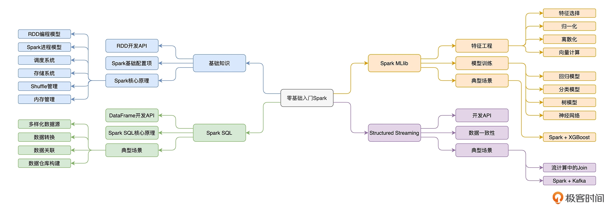
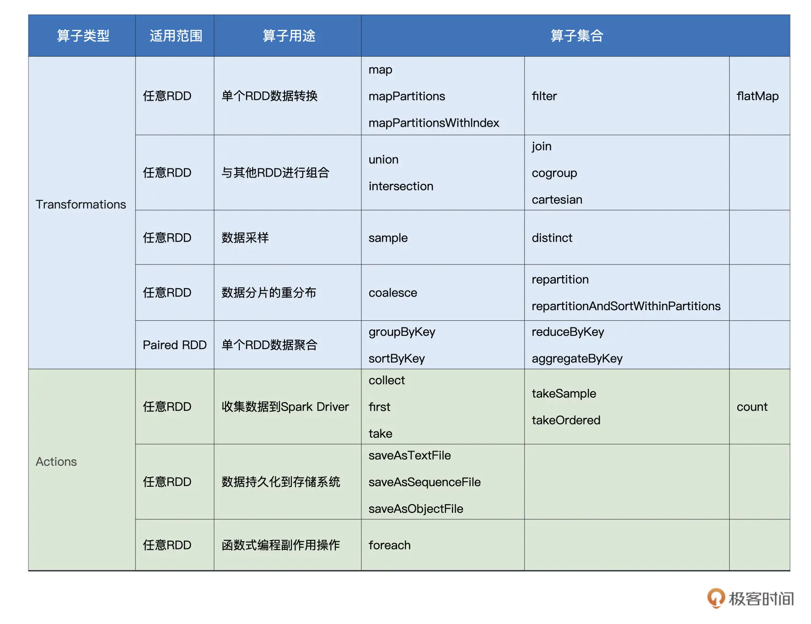
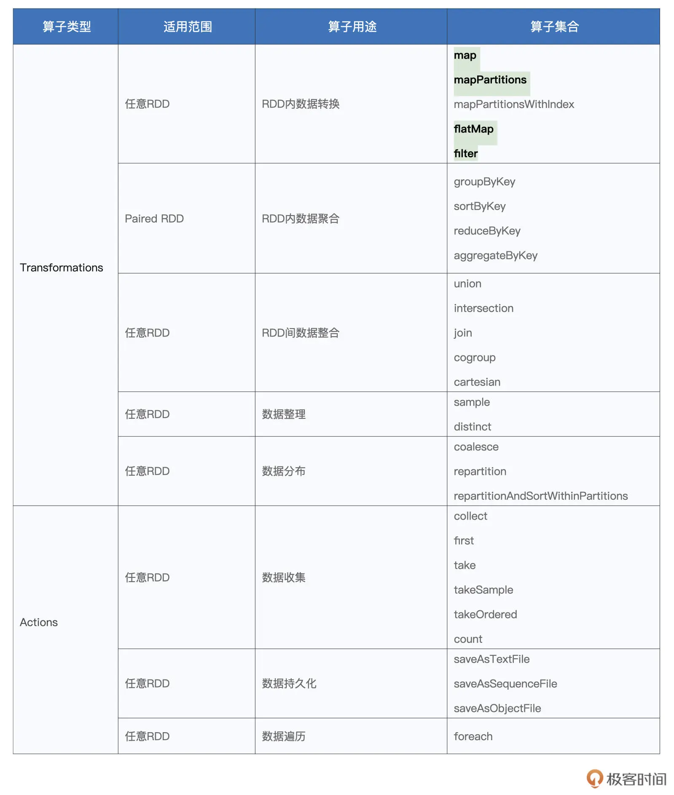

# learn-spark notes

# Spark

https://time.geekbang.org/column/intro/100090001?utm_campaign=geektime_search&utm_content=geektime_search&utm_medium=geektime_search&utm_source=geektime_search&utm_term=geektime_search&tab=catalog



## download spark

https://www.apache.org/dyn/closer.lua/spark/spark-3.5.1/spark-3.5.1-bin-hadoop3.tgz

## RDD 编程模型

RDD 的全称是 Resilient Distributed Dataset，意思是“弹性分布式数据集”

### RDD VS 数组


- 数组是实体，它是一种存储同类元素的数据结构，而 RDD 是一种抽象，它所囊括的是分布式计算环境中的分布式数据集。
- 数组的“活动范围”很窄，仅限于单个计算节点的某个进程内，而 RDD 代表的数据集是跨进程、跨节点的，它的“活动范围”是整个集群
- 在数组中，承载数据的基本单元是元素，而 RDD 中承载数据的基本单元是**数据分片（Partitions）**。在分布式计算环境中，一份完整的数据集，会**按照某种规则切割成多份数据分片**。这些数据分片被均匀地分发给集群内不同的计算节点和执行进程，从而实现分布式并行计算。

### RDD算子的类型



## RDD内部的数据转换

### RDD算子分类表



### map

### mapPartitions

### flatMap

### filter

### 创建RDD

- 通过 SparkContext.parallelize 在内部数据之上创建 RDD
    
    ```scala
    import org.apache.spark.rdd.RDD
    val words: Array[String] = Array("Spark", "is", "cool")
    val rdd: RDD[String] = sc.parallelize(words)
    ```
    
    - 通常来说，在 Spark 应用内定义体量超大的数据集，其实都是不太合适的，因为数据集完全由 Driver 端创建，且创建完成后，还要在全网范围内跨节点、跨进程地分发到其他 Executors，所以往往会带来性能问题。因此，parallelize API 的典型用法，是在“小数据”之上创建 RDD。
- 通过 SparkContext.textFile 等 API 从外部数据创建 RDD

## Spark 进程模型

## 调度系统

## 存储系统

## Shuffle 管理

## 内存管理

# Java

https://time.geekbang.org/course/intro/100027801?utm_campaign=geektime_search&utm_content=geektime_search&utm_medium=geektime_search&utm_source=geektime_search&utm_term=geektime_search&tab=catalog

# Scala

https://docs.scala-lang.org/getting-started/index.html

## download (Mac)

```jsx
curl -fL https://github.com/VirtusLab/coursier-m1/releases/latest/download/cs-aarch64-apple-darwin.gz | gzip -d > cs && chmod +x cs && (xattr -d com.apple.quarantine cs || true) && ./cs setup
```